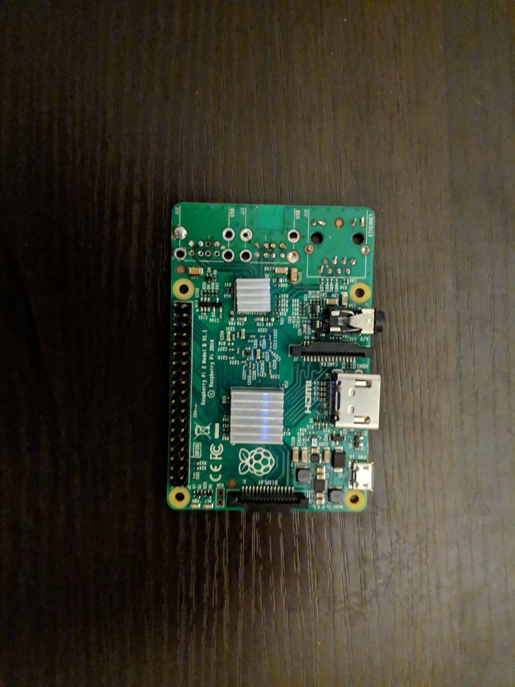
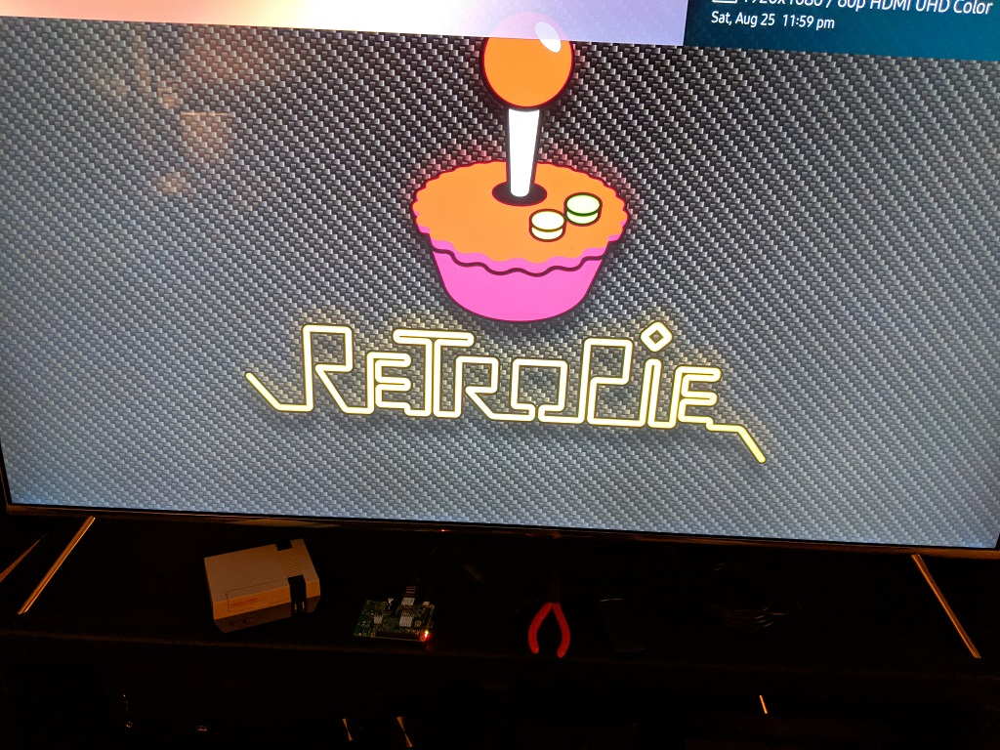
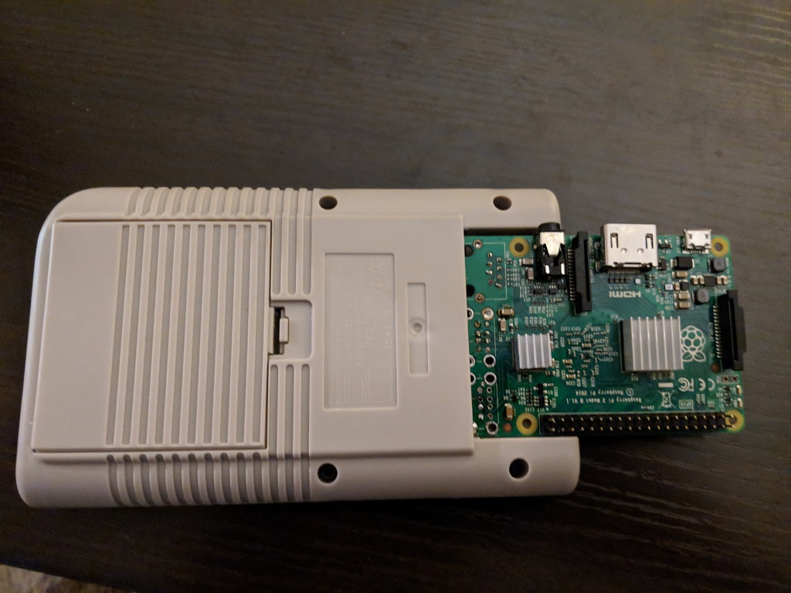
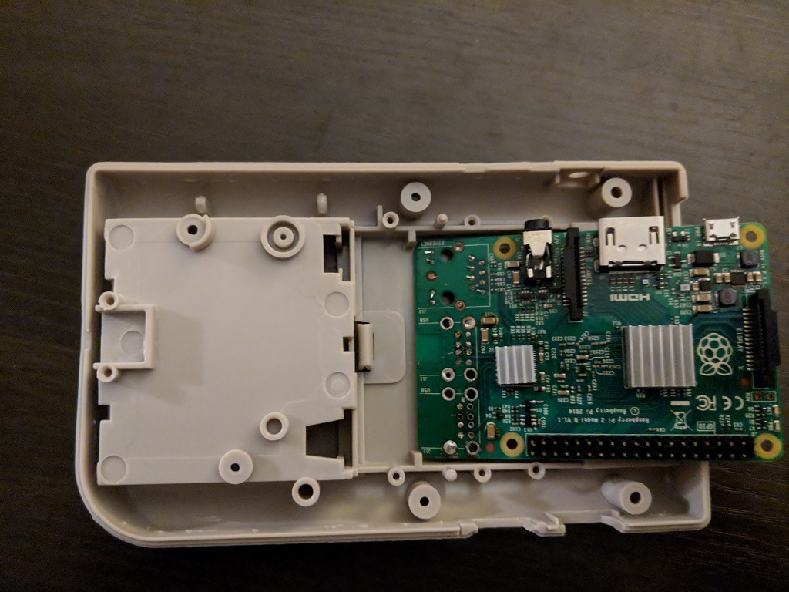

# Entry 1 - Raspberry Pi Carnage (August 26, 2018)

* [Previous](00-mega-pi-boy.md)

After a lot of research and especially reading various other build logs it
became clear that chopping down the raspberry pi to a size which could actually
fit into the DMG shell is crucial. So, with parts in hand I started practicing
this process on an "old" Raspberry Pi 2 I had laying around.

The process was straightforward but slow, and I'm not quite done yet. I just
got to the larger USB and Ethernet jacks for now. Those, still, need some cleanup.
That will come in the next entry. For those larger ports I started first with
some snips tearing down the metal enclosures. The plastic inside was then held
in place by some thin metal pins and could be ripped free. I then cleaned up
some with the snips to try and remove as much metal as possible from the board
before attempting to start actually desoldering things.

Once all of the cleanup was done, work started with the soldering iron and a
_lot_ of flux to try and move things along. The Pi is a ROHS board so it uses
lead-free solder. The stuff requires more heat that conventional solder and can
be a pain to work with. Go slow to avoid overheating board. Working one pad at
a time I was able to get a lot of the worst parts done.

A quick check shows the board still booting after all of this work. Looks like
going slow did the trick and avoided any major damage.  Of course, I couldn't
do much without any USB peripherals attached. Looks like I'll need to fab a
debug cable/headers of some kind that will fit into the slim form factor.

The ultimate goal is to use GPIO for the gamepad itself and disable USB power
entirely. This will disable the Gigabit Ethernet and USB chip in the 3B+ that
consumes [~200ma](https://www.raspberrypi.org/forums/viewtopic.php?t=208110) at
5V which will. That will the 3B+ fit into the constrained power budget. To that
end I will likely be using serial console access for configuration. Large transfers
will have to happen over WiFi or via direct manipulation of the SD card from my
Linux desktop.

The board, when it's all cleaned up, needs to fit into the cartridge slot. Later
(towards the end) we will be chopping up a cartridge to cover this up. With the
largest ports removed we can start to see how that can fit.

Things look pretty good on the inside as well. The Raspberry Pi 2 is similar
enough in layout to the 3B and 3B+ that we'll keep using it going forward as
a test dummy. That way, when I inevitably break something it'll happen not
on the "real thing".
